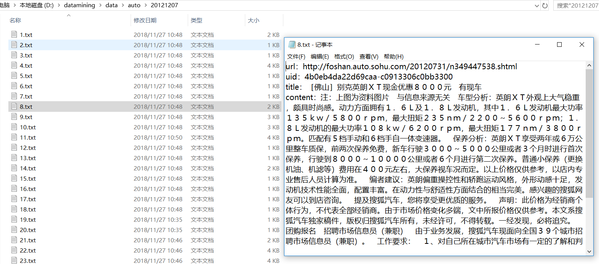
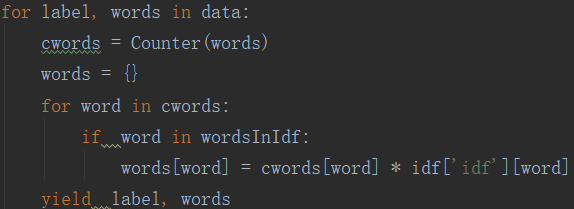
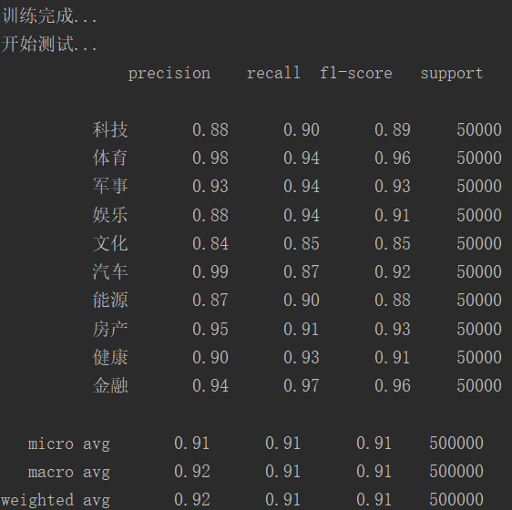
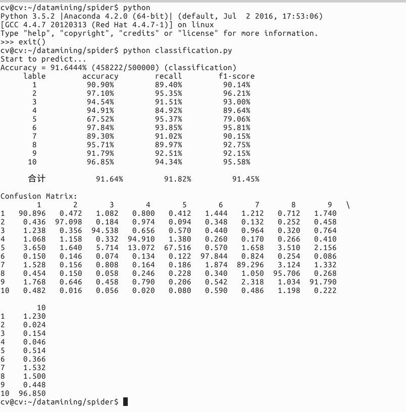
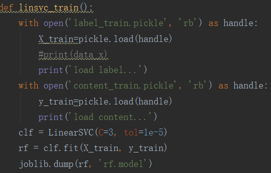
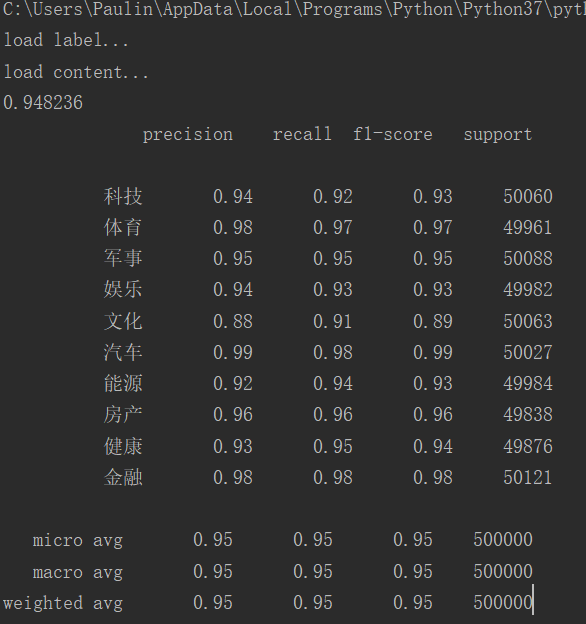

**课程名称： 数据仓库与数据挖掘**

**实验名称： 文本的分类**

实验目的
========

>   1.掌握数据预处理的方法，对训练集数据进行预处理；

>   2.掌握文本建模的方法，对语料库的文档进行建模；

>   3.掌握分类算法的原理，基于有监督的机器学习方法，训练文本分类器；

>   4.利用学习的文本分类器，对未知文本进行分类判别；

>   5.掌握评价分类器性能的评估方法。

实验内容及分工
==============

本实验实现了对数据的爬取、数据的预处理，实现了使用朴素贝叶斯分类算法、LinearSVC算法、LibSVM算法的训练和测试。

实验环境
========

>   操作系统：Windows10 64bit、Ubuntu-14.04-trusty

>   开发环境：PyCharm

实验使用工具及算法介绍
======================

1.  Scrapy

>   Scrapy是python开放的一个快速高层次的屏幕抓取和web抓取框架，用于抓取web站点并从页面中提取到结构化数据。Scrapy用途广泛，可以用于数据挖掘、监测和自动化测试。Scrapy运行的流程：首先引擎从调度器中取出一个链接（URL）用于接下来的抓取；引擎把URL封装成一个请求（Request）传给下载器；下载器把资源下载下来，并封装成应答包（Response）；爬虫解析Response；解析出实体（Item），则交给实体管道进行进一步的处理；解析出的是链接（URL），则把URL交给调度器等待抓取。

1.  Jieba分词

>   Jieba分词是python的中文分词组件，将提取到的新闻文本进行分词的处理。

1.  TF-IDF值

>   TF-IDF是词频-逆文本频率，是一种用于资讯检索与资讯探勘的常用加权技术。TF-IDF是一种统计方法，用于评估一字词对于一个文件集或者一个语料库中的其中一份文件的重要程度。字词的重要性随着它在文本中出现的次数成正比增加，但同时会随着它在语料库中出现的频率成反比下降。

1.  卡方检验

>   卡方检验可以用来衡量文本中的词与类别的相关性的程度，但是卡方检验存在缺点，它只统计了文档中是否出现词，而不管出现了几次，这会使得对于低频词有所偏袒，所以在实验中采用计算TF-IDF的卡方检验来评价词与类别的相关性然后对特征词进行降维处理。

1.  朴素贝叶斯算法

>   朴素贝叶斯适用于标称型数据的监督学习方法，NB本质是分类问题，根据样例属于哪个类的概率的大小判断样本属于哪个类。朴素贝叶斯有两个基本条件：朴素和贝叶斯定理。朴素就是特征之间的相互独立假设，就是特征1和特征2之间发生的概率相互不受影响，特征1的发生与否和特征2无关。另外每个特征同等重要。朴素贝叶斯训练的过程就是计算条件概率，测试的过程就是通过对概率之和进行比较选取最大值的过程。

1.  支持向量机算法

>   支持向量机是一种二分类模型，它的目的是寻找一个超平面来对样本进行分割，分割的原则是间隔最大化，最终转化为一个凸二次规划问题来求解。对于非线性问题，线性可分支持向量机并不能有效的解决，要使用非线性模型才能很好的分类。非线性问题往往不好求解，所以希望能用解线性分类问题的方法求解，因此采用非线性变换，将非线性问题变换成线性问题。对于这样的问题可以将训练样本从原始空间映射到一个更高维的空间，使得样本在这个空间中线性可分，如果原始空间维数是有限的，即属性是有限的，那么一定存在一个高维特征空间是样本可分。

1.  LinearSVC的优势

>   LinearSVC( )是最小化hinge loss的平方，SVC(kernel=’linear’)最小化hinge
>   loss，linearSVC( )使用one-vs-rest处理多类问题，SVC(kernel=’linear’)使用one-vs-one处理多类问题。SVC是SVM的一种类型，专门用来处理分类问题。LinearSVC在进行文本分类的速度比较快。

实验过程
========

1.  语料库的构建

>   在进行构建之前，本实验对语料库的主题进行选取，本实验选取了科技、体育、军事、娱乐、文化、汽车、能源、房产、健康、金融十个方面，使用Scrapy从新浪、搜狐爬取对应的主题的新闻语料。

1.  使用Python的Scrapy爬虫框架。爬取到的数据的格式为一个文本代表一篇新闻，文本中的内容是json格式，content中的内容为所需要的语料。如图1为爬取数据的格式。

图1 爬取的数据格式

1.  然后需要将每一类中所有爬取到的文本进行content内容的提取和合并，首先读取所有文件夹中的txt然后构建数组保存所有的文本，最后将数组中的内容写入到新的txt中，在实现这一过程中可以使用Tqdm，对数据处理的进度进行显示。

2.  通过上面的步骤得到了十类大的文本，每一类文本中包含大约10万行，每一行代表着一条新闻文本，但是现在的数据并不是干净的数据所以需要对数据进行分词然后取名词。

3.  使用jieba分词对十类文本进行分词处理然后选择名词其中选择了n（名词）、nt（机构团体）、nl（习用语）、nz（其他专名）、ng（名语素），进行分词的同时导入停用词的文档然后将不属于停用词的词语写入新的文档中。这样的到的就是处理好的干净的文档。干净文档的格式如图2所示：

>   D:\\datamining\\结果\\cleandate.PNG

>   图 2 cleandata

1.  计算TF-IDF值

>   本实验使用TF-IDF值来描述文本文档中的词的重要程度。TF指的是某一个给定的词语在该文件中出现的次数。这个数字通常会被归一化（一般是词频除以文章的总词数），以防止它偏向长的文件。
>
>   w为在某一类中词条W出现的次数；ALL表示该类中词条的所有数目

$$
TF_{w} = \frac{W}{ALL}
$$

>   IDF是逆向文件频率，如果包含词条t的文档越少，IDF越大，则说明词条具有很好的类别区分能力。某一特定词语的IDF，可以由总文件数目除以包含该词语之文件的数目，再将得到的商取对数得到。
>
>   w表示包含该词条的文档数；ALL表示语料库中所有的文档总数

$$
\text{IDF} = \log\left( \frac{ALL}{w + 1} \right)
$$

>   某一特定文件内的高词语频率，以及该词语在整个文件中的低文件频率，可以产生高权重的TF-IDF。因此，TF-IDF倾向于过滤常见的词语，保留重要的词语。

$$
\text{TF} - \text{IDF} = \text{TF}*\text{IDF}
$$

>   在程序中首先使用Collections中的Counter对文档中的词语出现的次数进行统计。然后转换为DataFrame的格式进行计算。图3是计算IDF值的代码。

>   图3 计算IDF

>   将词频和IDF值相乘计算所有词语的TF-IDF值，图4计算TF-IDF值的代码。

>   图4 计算TF-IDF

1.  卡方检验构建词袋

>   卡方检验用来计算所有词语与类别之间的相关性的强弱。在文本分类的特征选择阶段，一般使用“词t与类别c不相关”来做假设，计算出的开方值越大，说明对原加假设的偏离越大，所以就认为原假设的反面情况是正确的，选择的过程为每个词计算它与类别c的开方值，从大到小排个序，然后取前k个就可以。图5是卡方检验构建词袋的代码。

>   例如，N篇文档分类有体育和非体育，考察特征词“篮球”与类别“体育”的相关性。

| 特征选择   | 属于“体育” | 不属于“体育” | 总计 |
|------------|------------|--------------|------|
| 包含篮球   | A          | B            | A+B  |
| 不包含篮球 | C          | D            | C+D  |
| 总数       | A+C        | B+D          | N    |

$$
X^{2}(Basketball,Sports) = \frac{{(AD - BC)}^{2}}{(A + B)(C + D)}
$$

>   但是卡方检验存在缺点：只统计了文档是否出现词，而不管出现了几次，这会使得对低频词有所偏袒，所以实验中使用了词的TF-IDF值来进行卡方检验。然后进行排序选择前4000个作为特征词构建词袋。

图5 卡方检验构建词袋

1.  朴素贝斯分类

>   贝叶斯定理，用来描述两个条件概率之间的关系，比如P(A\|B)和P(B\|A)。按照乘法法则，可以导出:P(AՈB)=P(A)\*P(B\|A)=P(B)\*P(A\|B)。朴素贝叶斯分类器的基本原理就是贝叶斯原理，如果数据的特征属性值为x1=(a1,a2,a3….,am)，假设它有m个特征值，类别只有A类和B类的话，想要根据x1的特征值来判断它属于哪个类别的概率最高，从概率的角度进行分类。

>   首先需要计算P(A\|x1)和P(B\|x1)，并进行大小比较确定分类结果。根据贝叶斯定理，计算两种分类的条件概率：

$$
P\left( A \middle| x1 \right) = P\left( A \middle| a1,a2,\ldots.am \right) = \frac{P\left( a1,a2,\ldots.am \middle| A \right)*P\left( A \right)}{P\left( a1,a2,\ldots.,am \right)} = \frac{P\left( a1 \middle| A \right)*P\left( a2 \middle| A \right)*\ldots P\left( \text{am} \middle| A \right)*P(A)}{p\left( a1 \right)*P\left( a2 \right)*\ldots.*P(am)}
$$

$$
P\left( B \middle| x1 \right) = P\left( B \middle| a1,a2,\ldots.am \right) = \frac{P\left( a1,a2,\ldots.am \middle| B \right)*P\left( B \right)}{P\left( a1,a2,\ldots.,am \right)} = \frac{P\left( a1 \middle| B \right)*P\left( a2 \middle| B \right)*\ldots P\left( \text{am} \middle| B \right)*P(B)}{p\left( a1 \right)*P\left( a2 \right)*\ldots.*P(am)}
$$

条件概率P(a\|A)=0的处理

>   当某个类别下某个特征项划分没有出现一次时，就会导致P(ai\|A)=0，0乘上其它的结果为0。这就导致我们求得条件概率结果不准确。为了解决这个问题，我们引入“拉普拉斯修正”，思路如下：

$$
P(xi|c) = \frac{\left| D_{c,xi} \right| + 1}{\left| D_{c} \right| + N_{i}}
$$

朴素贝叶斯代码如图6所示。

图6 朴素贝叶斯计算

朴素贝叶斯计算出的概率矩阵如图7所示。

图7 条件概率矩阵

有了条件概率矩阵在进行测试集测试过程中，对测试集中文本中的词的在所有类中的概率进行累加求和然后进行比较选择十类当中该文本计算的概率值最大的类别就是测试出来的类别。

测试完毕后计算正确率、召回率和F1-Score。

True Positive（真正，TP）：将正类预测为正类数；True
Negative（真负，TN）：将负类预测为负类数；False
Positive（假正，FP）：将负类预测为正类数（误报）；False
Negative（假负，FN）：将正类预测为负类数（漏报）。

精确率（precision）：是对预测结果而言的指标。作用的主要范围主要是我们在预测结果中。对于实际结果集的大小，并不在精确的考虑中。

$$
P = \frac{\text{TP}}{TP + FP}
$$

召回率（recall）：是对我们原来的样本而言，它表示的是样本中的正例有多少被预测正确了。那也有两种可能，一种是把原来的正类预测为正类（TP），另一种就是把原来的正类预测为负类（FN）。

$$
R = \frac{\text{TP}}{TP + FN}
$$

准确率（accuracy）：

$$
\text{Accuracy} = \frac{(TP + TN)}{(TP + FN + FP + TN)}
$$

>   准确率面向的是所有应该选中和不应该选中的样本。

F1-Score：

从上面的P和R的公式中，很容易发现，两者的存在可能会有一定的矛盾，很难实现双高的情况，为了兼顾这两个目标，我们提出了F1-Score：

$$
F1 = 2*\frac{\text{precision}*\text{recall}}{precison + recall}
$$

图8是朴素贝叶斯的分类结果。朴素贝叶斯算法最终的正确率大约92%。

图8 朴素贝叶斯分类结果

然后图9显示混淆矩阵的结果。

图9 混淆矩阵结果

1.  LibSVM分类

>   使用LibSVM首先需要将数据处理成LibSVM的格式，LibSVM的输入格式为label1
>   dimension1：value1 dimension2：value2…将数据处理成上述格式的代码如图10所示。

>   图10 LibSVM数据处理过程

>   然后调用LibSVM的函数进行LibSVM的训练。

>   图11 LibSVM函数调用

>   LibSVM训练和测试在服务器上运行，LibSVM训练会产生一个model文件，在进行测试的时候直接调用model然后进行测试，LibSVM的训练和测试在服务器上运行，图12显示了LibSVM的测试的结果。LibSVM的最终的正确率大约92%。

>   D:\\datamining\\结果\\libsvm.PNG

>   图12 LibSVM测试结果

1.  LinearSVC分类

>   LinearSVC的代码通过调用sklearn库实现，处理的过程为首先使用sklearn的train_test_split函数将数据分成LinearSVC输入所需要的数据格式的训练集和测试集，然后计算训练集的TF-IDF值，然后使用卡方检验取4000特征词，然后进行训练，测试。图13显示LinearSVC的训练函数。

>   图13 LinearSVC训练

>   训练结束之后对测试集进行测试，测试结果如图14所示，测试结果大约为95%

>   图14 LinearSVC训练结果和混淆矩阵

实验结果和性能评估
==================

>   LinearSVC的实验结果如下表所示。

| 类别 | 准确率 | 召回率 |
|------|--------|--------|
| 科技 | 94%    | 92%    |
| 体育 | 98%    | 97%    |
| 军事 | 95%    | 95%    |
| 娱乐 | 94%    | 93%    |
| 文化 | 88%    | 91%    |
| 汽车 | 99%    | 98%    |
| 能源 | 92%    | 94%    |
| 房产 | 96%    | 96%    |
| 健康 | 93%    | 95%    |
| 金融 | 98%    | 98%    |
| 平均 | 95%    | 95%    |

>   通过表格可以看出：

>   平均准确率为95%，平均召回率为95%。准确率最高的是汽车类99%，最低的是文化类88%；召回率中最高的是汽车类、金融类98%，最低的是文化91%。

朴素贝叶斯、LibSVM、LinearSVC性能对比：

| 分类器   | 朴素贝叶斯 | LibSVM | LinearSVC |
|----------|------------|--------|-----------|
| 准确率   | 92%        | 92%    | 95%       |
| 训练时间 | 100s       | 10h    | 240s      |
| 测试时间 | 300s       | 5h     | 2s        |

>   从上表可以得出，LinearSVC的性能是最好的，训练时间相对较短，但是测试时间最短，准确率最高。

实验总结
========

>   通过文本的分类的实验，掌握了文本实验的基本过程，数据预处理的基本过程，使用交叉验证将数据分为训练集和测试集，使用TF-IDF值进行卡方检验然后构建词袋，实现降维然后将数据处理成LibSVM和LinearSVC需要的数据格式，然后进行模型的训练，最后进行模型的测试，通过实验我们发现，LinearSVC的性能和结果是最好的。
